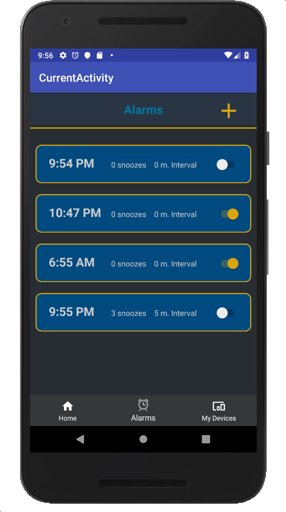
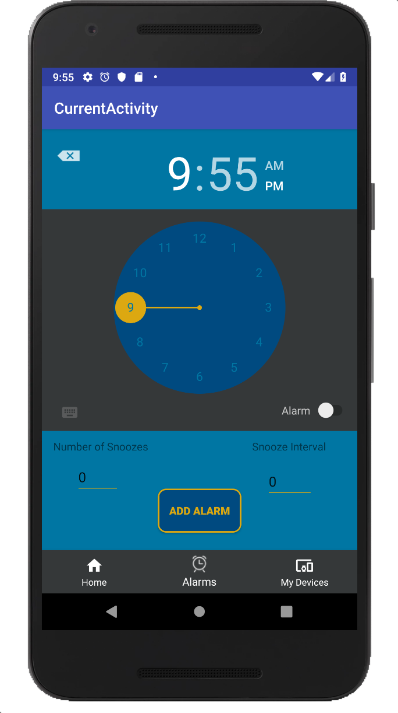

# iRoNa

## An Android Alarm Clock and IoT Mobile Application
> iRoNa is an Android application designed for people who have trouble waking up.  It works by connecting to a mat that contains a Raspberry Pi.  Whenever the Alarm  starts, the only way to turn it off is for the user to physically stand on the mat for 3 seconds, hence, making them wake up.
<!-- >   >  -->

> 
> 

<!-- >  -->

----
### App Overview

----
- **Alarm Customization**

   iRona allows the user to fully customize their Waking-Up experience by adding the ability to specify the number of snoozes for each alarm and the time interval between each snooze.

  <!-- >  -->
> 

  <!-- 
  width="500" -->

- **Home IoT Integration (Coming Soon)**

  iRoNa aims to seamlessly integrate all the aspects of a users Smart Home with the app.  This feature will allow a user to add any programmable IoT device to the app and specify the devices settings, so that when the alarm goes off and the user steps on the Mat, these settings are activated.

